# Topic 2.9 - Pandas 中自带画图功能

在本节开始前，我们先导入一下 Pandas 库：


```python
import pandas as pd
import random
```

## 1. Pandas 的绘图功能简介

在数据分析的可视化任务中：

- 常用的作图库是 Matplotlib 和 Seaborn
- 但实际上 Pandas 库本身也内置了一些基本的绘图功能，能够满足一些简单的数据可视化需求
- 和专门的作图库相比，Pandas 的绘图功能相对简单，适合快速生成一些基础的图表，讲究的是方便快捷，而不是复杂和美观
- 如果作图目标是快速发现数据中的趋势和模式，Pandas 的绘图功能是一个不错的选择

总的来说，Pandas 绘图的基本语法是 `DataFrame.plot()` 或 `Series.plot()`：

- 也就是直接在 DataFrame 或 Series（可以是 DataFrame 的一列或一行） 对象上调用 `plot()` 方法
- 然后指定图表类型和相关参数即可，例如图表类型、数据列、标题、标签等

## 2. 常见的图表类型及其绘制方法

### (1) 折线图

折线图是最常见的图表类型之一，适合展示数据随时间或其他连续变量的变化趋势。

我们先来准备一组时间序列数据，然后绘制折线图，最好将 index 设置为时间序列，以便更直观地展示数据的变化趋势：


```python
df1 = pd.DataFrame({
    "A": [random.randrange(1, 100) for _ in range(10)],
    "B": [random.randrange(1, 100) for _ in range(10)],
    "C": [random.randrange(1, 100) for _ in range(10)],
}, index=pd.date_range("2023-01-01", periods=10))

df1
```


<div>
<style scoped>
    .dataframe tbody tr th:only-of-type {
        vertical-align: middle;
    }

    .dataframe tbody tr th {
        vertical-align: top;
    }

    .dataframe thead th {
        text-align: right;
    }
</style>
<table border="1" class="dataframe">
  <thead>
    <tr style="text-align: right;">
      <th></th>
      <th>A</th>
      <th>B</th>
      <th>C</th>
    </tr>
  </thead>
  <tbody>
    <tr>
      <th>2023-01-01</th>
      <td>13</td>
      <td>98</td>
      <td>97</td>
    </tr>
    <tr>
      <th>2023-01-02</th>
      <td>35</td>
      <td>7</td>
      <td>64</td>
    </tr>
    <tr>
      <th>2023-01-03</th>
      <td>34</td>
      <td>65</td>
      <td>21</td>
    </tr>
    <tr>
      <th>2023-01-04</th>
      <td>69</td>
      <td>4</td>
      <td>43</td>
    </tr>
    <tr>
      <th>2023-01-05</th>
      <td>46</td>
      <td>42</td>
      <td>64</td>
    </tr>
    <tr>
      <th>2023-01-06</th>
      <td>43</td>
      <td>84</td>
      <td>89</td>
    </tr>
    <tr>
      <th>2023-01-07</th>
      <td>29</td>
      <td>34</td>
      <td>16</td>
    </tr>
    <tr>
      <th>2023-01-08</th>
      <td>14</td>
      <td>98</td>
      <td>45</td>
    </tr>
    <tr>
      <th>2023-01-09</th>
      <td>1</td>
      <td>27</td>
      <td>5</td>
    </tr>
    <tr>
      <th>2023-01-10</th>
      <td>29</td>
      <td>47</td>
      <td>68</td>
    </tr>
  </tbody>
</table>
</div>


- 如果只画一列对应的一条线，可以直接在一列上调用 `plot()` 方法，并强调 `kind='line'`：


```python
df1["A"].plot(kind='line')
```


    <Axes: >


    
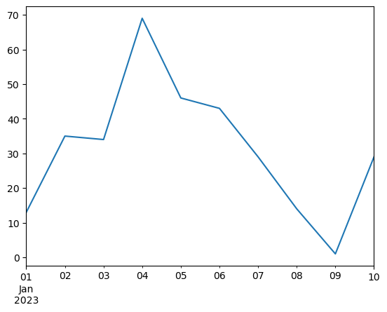
    


- 如果想将多条线绘制在同一张图上，可以直接在 DataFrame 上调用 `plot()` 方法，并在 `y` 参数中指定多列数据：


```python
df1.plot(y=["A", "B"], kind='line')
```


    <Axes: >


    
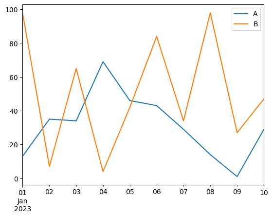
    


- 如果将所有列都绘制在同一张图上，可以直接在 DataFrame 上调用 `plot()` 方法而不指定列：


```python
df1.plot(kind='line')
```


    <Axes: >


    
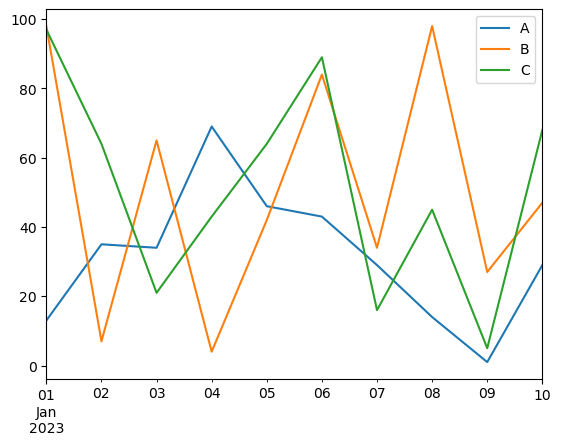
    


### (2) 柱状图

柱状图适合展示不同类别之间的比较，常用于显示分类数据的分布情况。

首先，我们准备一组分类数据，然后绘制柱状图，柱状图的数据通常是离散的类别和对应的数值：


```python
df2 = pd.DataFrame({
    "A": [random.randrange(10, 100) for _ in range(4)],
    "B": [random.randrange(10, 100) for _ in range(4)],
    "C": [random.randrange(10, 100) for _ in range(4)]
}, index=["Q1", "Q2", "Q3", "Q4"])

df2
```


<div>
<style scoped>
    .dataframe tbody tr th:only-of-type {
        vertical-align: middle;
    }

    .dataframe tbody tr th {
        vertical-align: top;
    }

    .dataframe thead th {
        text-align: right;
    }
</style>
<table border="1" class="dataframe">
  <thead>
    <tr style="text-align: right;">
      <th></th>
      <th>A</th>
      <th>B</th>
      <th>C</th>
    </tr>
  </thead>
  <tbody>
    <tr>
      <th>Q1</th>
      <td>83</td>
      <td>62</td>
      <td>78</td>
    </tr>
    <tr>
      <th>Q2</th>
      <td>57</td>
      <td>17</td>
      <td>87</td>
    </tr>
    <tr>
      <th>Q3</th>
      <td>33</td>
      <td>16</td>
      <td>13</td>
    </tr>
    <tr>
      <th>Q4</th>
      <td>49</td>
      <td>14</td>
      <td>25</td>
    </tr>
  </tbody>
</table>
</div>


- 如果想绘制普通柱状图，我们要在 DataFrame 上调用 `plot()` 方法，指定 `y` 参数来绘制柱状图，并强调 `kind='bar'`：


```python
df2.plot(y=['A'], kind='bar')
```


    <Axes: >


    
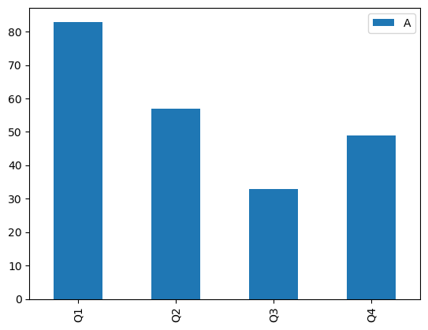
    


- 如果绘制分组柱状图，则可以在 DataFrame 上调用 `plot()` 方法，指定 `kind='bar'`，Pandas 会自动将不同类别的数据分组显示：

    - 和折线图一样，如果想绘制多列数据，可以在 `y` 参数中指定多列数据
    - 而如果想要绘制所有列的数据，可以直接在 DataFrame 上调用 `plot()` 方法而不指定 `y` 参数 


```python
df2.plot(y =['A', 'B'], kind='bar')
```


    <Axes: >


    
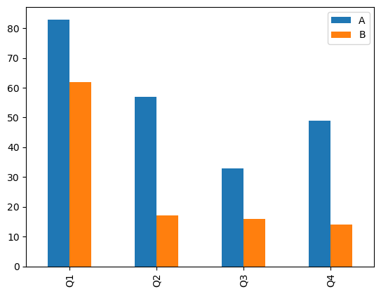
    


```python
df2.plot(kind='bar')
```


    <Axes: >


    
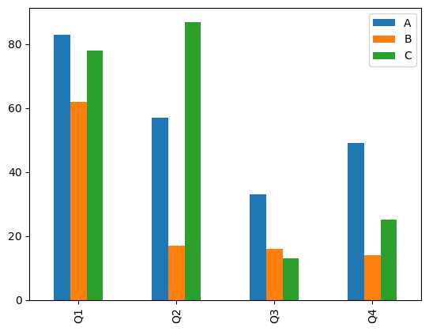
    


- 如果想绘制堆叠柱状图，可以在 `plot()` 方法中指定 `kind='bar'` 并设置 `stacked=True` 参数：

    - 同样，如果想绘制多列数据，可以在 `y` 参数中指定多列数据
    - 如果想要绘制所有列的数据，可以直接在 DataFrame 上调用 `plot()` 方法而不指定 `y` 参数


```python
df2.plot(y=['A', 'B'], kind='bar', stacked=True)
```


    <Axes: >


    
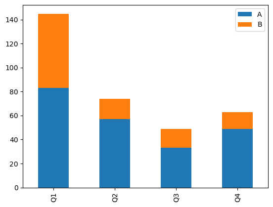
    


```python
df2.plot(kind='bar', stacked=True)
```


    <Axes: >


    
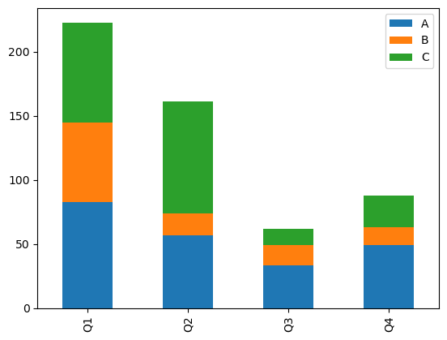
    


### (3) 饼状图

饼状图适合展示各部分在整体中所占的比例，常用于显示分类数据的组成情况。

首先，我们准备一组分类数据，然后绘制饼状图，饼状图通常用于显示单个类别的比例分布：


```python
df3 = pd.DataFrame({
    "A": [random.randrange(10, 100) for _ in range(4)],
    "B": [random.randrange(10, 100) for _ in range(4)],
    "C": [random.randrange(10, 100) for _ in range(4)]
}, index=["Q1", "Q2", "Q3", "Q4"])

df3
```


<div>
<style scoped>
    .dataframe tbody tr th:only-of-type {
        vertical-align: middle;
    }

    .dataframe tbody tr th {
        vertical-align: top;
    }

    .dataframe thead th {
        text-align: right;
    }
</style>
<table border="1" class="dataframe">
  <thead>
    <tr style="text-align: right;">
      <th></th>
      <th>A</th>
      <th>B</th>
      <th>C</th>
    </tr>
  </thead>
  <tbody>
    <tr>
      <th>Q1</th>
      <td>83</td>
      <td>39</td>
      <td>63</td>
    </tr>
    <tr>
      <th>Q2</th>
      <td>35</td>
      <td>82</td>
      <td>18</td>
    </tr>
    <tr>
      <th>Q3</th>
      <td>95</td>
      <td>95</td>
      <td>70</td>
    </tr>
    <tr>
      <th>Q4</th>
      <td>30</td>
      <td>14</td>
      <td>81</td>
    </tr>
  </tbody>
</table>
</div>


- 在 Pandas 中，饼图和折线图、柱状图有所不同，因为饼图通常是针对单个 Series（即单列数据）进行绘制的：

    - 因此，我们需要先选择 DataFrame 中的一列或一行数据，然后在该列上调用 `plot()` 方法，并指定 `kind='pie'` 参数即可绘制饼图
    - 在整个 DataFrame 上调用 `plot()` 方法是无法直接绘制饼图的

- 我们先来看选用一列数据绘制饼图的例子，在上面的数据中，它展示的是同一商品在各季度的销售比例：


```python
df3["A"].plot(kind='pie')
```


    <Axes: ylabel='A'>


    
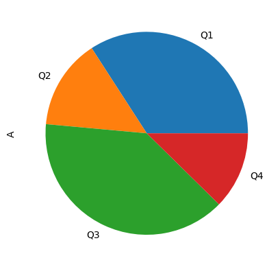
    


- 我们再来看选用一行数据绘制饼图的例子，这次展示的是各商品在某一季度的销售比例：


```python
df3.loc["Q1"].plot(kind='pie')
```


    <Axes: ylabel='Q1'>


    
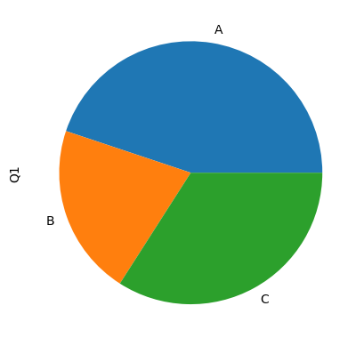
    


### (4) 散点图

散点图常用的情景是展示两个变量之间的关系，适合用于探索数据中的相关性。

首先，我们准备一组包含两个变量的数据，然后绘制散点图，要注意散点图的 X 和 Y 都应该是数值型数据：


```python
df4 = pd.DataFrame({
    "X": [random.uniform(1, 100) for _ in range(20)],
    "Y": [random.uniform(1, 100) for _ in range(20)],
})

df4
```


<div>
<style scoped>
    .dataframe tbody tr th:only-of-type {
        vertical-align: middle;
    }

    .dataframe tbody tr th {
        vertical-align: top;
    }

    .dataframe thead th {
        text-align: right;
    }
</style>
<table border="1" class="dataframe">
  <thead>
    <tr style="text-align: right;">
      <th></th>
      <th>X</th>
      <th>Y</th>
    </tr>
  </thead>
  <tbody>
    <tr>
      <th>0</th>
      <td>51.553462</td>
      <td>22.586876</td>
    </tr>
    <tr>
      <th>1</th>
      <td>53.622465</td>
      <td>38.644271</td>
    </tr>
    <tr>
      <th>2</th>
      <td>7.567322</td>
      <td>37.656261</td>
    </tr>
    <tr>
      <th>3</th>
      <td>90.576675</td>
      <td>44.737475</td>
    </tr>
    <tr>
      <th>4</th>
      <td>92.856210</td>
      <td>17.032500</td>
    </tr>
    <tr>
      <th>5</th>
      <td>55.166151</td>
      <td>31.707984</td>
    </tr>
    <tr>
      <th>6</th>
      <td>64.575843</td>
      <td>53.156904</td>
    </tr>
    <tr>
      <th>7</th>
      <td>95.589727</td>
      <td>58.635147</td>
    </tr>
    <tr>
      <th>8</th>
      <td>12.628597</td>
      <td>78.055815</td>
    </tr>
    <tr>
      <th>9</th>
      <td>91.520935</td>
      <td>11.524723</td>
    </tr>
    <tr>
      <th>10</th>
      <td>77.749923</td>
      <td>78.860611</td>
    </tr>
    <tr>
      <th>11</th>
      <td>95.569139</td>
      <td>99.144078</td>
    </tr>
    <tr>
      <th>12</th>
      <td>34.903064</td>
      <td>54.306897</td>
    </tr>
    <tr>
      <th>13</th>
      <td>52.592837</td>
      <td>61.907817</td>
    </tr>
    <tr>
      <th>14</th>
      <td>43.521850</td>
      <td>13.409684</td>
    </tr>
    <tr>
      <th>15</th>
      <td>26.351539</td>
      <td>84.081360</td>
    </tr>
    <tr>
      <th>16</th>
      <td>35.667794</td>
      <td>89.842754</td>
    </tr>
    <tr>
      <th>17</th>
      <td>67.773081</td>
      <td>61.227916</td>
    </tr>
    <tr>
      <th>18</th>
      <td>65.024168</td>
      <td>64.278946</td>
    </tr>
    <tr>
      <th>19</th>
      <td>54.613929</td>
      <td>4.357693</td>
    </tr>
  </tbody>
</table>
</div>


在绘制散点图的时候，我们需要指定 `x` 和 `y` 参数来分别表示横轴和纵轴的数据列，并强调 `kind='scatter'` 参数：


```python
df4.plot(kind='scatter', x='X', y='Y')
```


    <Axes: xlabel='X', ylabel='Y'>


    
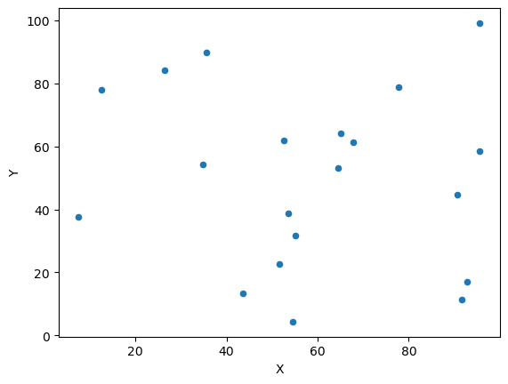
    


### (5) 其他的图表类型

事实上，通过上面几种常见的图表类型，大家已经可以体会到 Pandas 绘图功能的基本用法了：

- 其实就是在 DataFrame 或 Series 对象上调用 `plot()` 方法
- 之后，指定 `kind` 参数来选择图表类型
- 使用 `x` 和 `y` 参数来指定数据列

Pandas 当中还支持其他类型的图表，我们这里就不一一展示了，这些图表都符合上述的基本用法：

- 箱线图（Box Plot）：`kind='box'`
- 直方图（Histogram）：`kind='hist'`
- 面积图（Area Plot）：`kind='area'`
- 等等

## 3. 常见的图表装饰方法

在 `plot()` 方法中，我们还可以使用一些常见的参数来装饰图表，使其更具可读性和美观性。

### (1) 添加标题和标签

在 `plot()` 方法中，添加文字标题和标签的方法包括：

- `title`：设置图表标题
- `xlabel`：设置 X 轴标签
- `ylabel`：设置 Y 轴标签


```python
df5 = pd.DataFrame({
    "A": [random.randrange(10, 100) for _ in range(4)],
    "B": [random.randrange(10, 100) for _ in range(4)],
    "C": [random.randrange(10, 100) for _ in range(4)]
}, index=["Q1", "Q2", "Q3", "Q4"])

df5
```


<div>
<style scoped>
    .dataframe tbody tr th:only-of-type {
        vertical-align: middle;
    }

    .dataframe tbody tr th {
        vertical-align: top;
    }

    .dataframe thead th {
        text-align: right;
    }
</style>
<table border="1" class="dataframe">
  <thead>
    <tr style="text-align: right;">
      <th></th>
      <th>A</th>
      <th>B</th>
      <th>C</th>
    </tr>
  </thead>
  <tbody>
    <tr>
      <th>Q1</th>
      <td>76</td>
      <td>16</td>
      <td>11</td>
    </tr>
    <tr>
      <th>Q2</th>
      <td>77</td>
      <td>18</td>
      <td>56</td>
    </tr>
    <tr>
      <th>Q3</th>
      <td>63</td>
      <td>21</td>
      <td>86</td>
    </tr>
    <tr>
      <th>Q4</th>
      <td>81</td>
      <td>30</td>
      <td>86</td>
    </tr>
  </tbody>
</table>
</div>


```python
df5.plot(kind='line',
         title='Sales Over Quarters',
         xlabel='Quarter',
         ylabel='Sales Amount')
```


    <Axes: title={'center': 'Sales Over Quarters'}, xlabel='Quarter', ylabel='Sales Amount'>


    
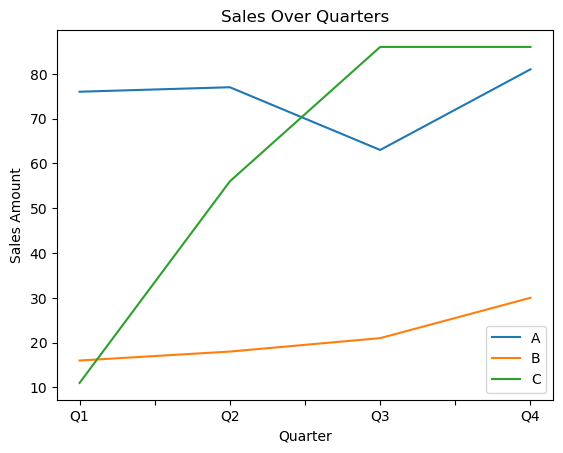
    


### (2) 设置图例

图例通常是 `plot()` 函数自动生成的，但我们也可以通过 `legend` 参数来控制图例的显示：

- `legend=True`：显示图例
- `legend=False`：隐藏图例


```python
df5.plot(kind='line',
         title='Sales Over Quarters',
         xlabel='Quarter',
         ylabel='Sales Amount',
         legend=False)
```


    <Axes: title={'center': 'Sales Over Quarters'}, xlabel='Quarter', ylabel='Sales Amount'>


    
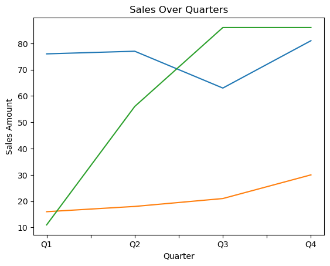
    


### (3) 设置图表大小

在 `plot()` 方法中，可以使用 `figsize` 参数来设置图表的大小：

- 这个方法传入一个元组 `figsize=(width, height)`：指定图表的宽度和高度，单位为英寸
- 这里的英寸指的是物理尺寸，而不是像素尺寸，因此实际显示效果还会受到显示设备分辨率的影响


```python
df5.plot(kind='line',
         title='Sales Over Quarters',
         xlabel='Quarter',
         ylabel='Sales Amount',
         legend=False,
         figsize=(6, 4))
```


    <Axes: title={'center': 'Sales Over Quarters'}, xlabel='Quarter', ylabel='Sales Amount'>


    
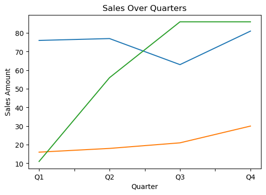
    


## 4. Pandas 自带图表与 Matplotlib 的关系

事实上，Pandas 自带的绘图功能实际上是基于 Matplotlib 库实现的：

- 因此，我们可以在使用 Pandas 绘图时，同时利用 Matplotlib 的一些高级功能来进一步定制图表
- 而且之后，我们学到一些 Matplotlib 的知识后，也可以将其应用到 Pandas 绘图中，从而实现更复杂和美观的图表效果
- 这里我们举个例子，比方说，我们可以使用 Pandas 绘制一个简单的折线图，然后利用 Matplotlib 来添加更多的自定义元素，比如网格线、注释等：


```python
df5 = pd.DataFrame({
    "A": [random.randrange(10, 100) for _ in range(4)],
    "B": [random.randrange(10, 100) for _ in range(4)],
    "C": [random.randrange(10, 100) for _ in range(4)]
}, index=["Q1", "Q2", "Q3", "Q4"])

df5
```


<div>
<style scoped>
    .dataframe tbody tr th:only-of-type {
        vertical-align: middle;
    }

    .dataframe tbody tr th {
        vertical-align: top;
    }

    .dataframe thead th {
        text-align: right;
    }
</style>
<table border="1" class="dataframe">
  <thead>
    <tr style="text-align: right;">
      <th></th>
      <th>A</th>
      <th>B</th>
      <th>C</th>
    </tr>
  </thead>
  <tbody>
    <tr>
      <th>Q1</th>
      <td>64</td>
      <td>42</td>
      <td>55</td>
    </tr>
    <tr>
      <th>Q2</th>
      <td>69</td>
      <td>52</td>
      <td>92</td>
    </tr>
    <tr>
      <th>Q3</th>
      <td>44</td>
      <td>57</td>
      <td>48</td>
    </tr>
    <tr>
      <th>Q4</th>
      <td>41</td>
      <td>83</td>
      <td>38</td>
    </tr>
  </tbody>
</table>
</div>


```python
import matplotlib.pyplot as plt

df5.plot(kind='line',
         title='Sales Over Quarters',
         xlabel='Quarter',
         ylabel='Sales Amount')

plt.grid(True)
plt.show()
```


    
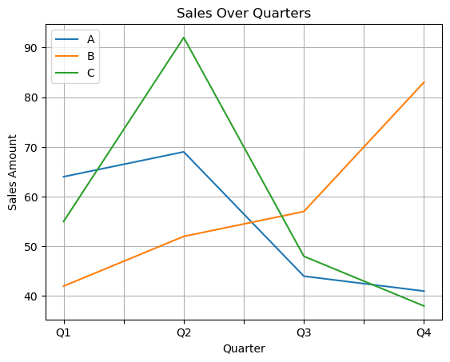
    


当然，两种库的绘图代码混用可能会有些问题：

- 一是版本冲突和兼容性的问题
- 二是代码风格和习惯的问题
- 因此，在实际项目中，建议尽量选择一种绘图库进行绘图，避免混用带来的潜在问题
